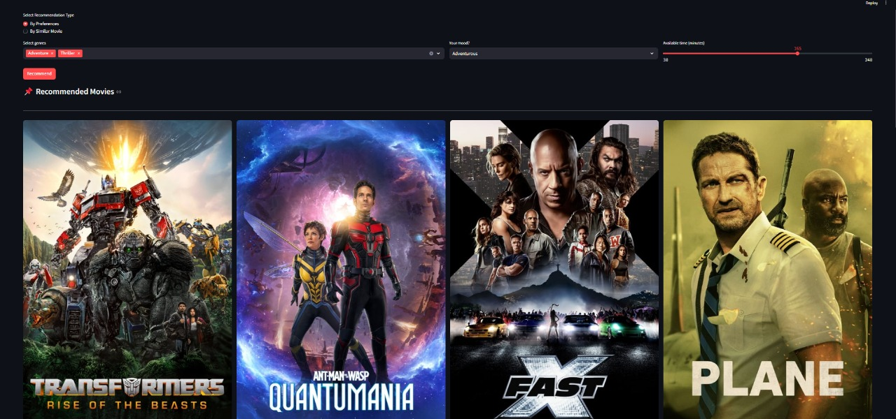
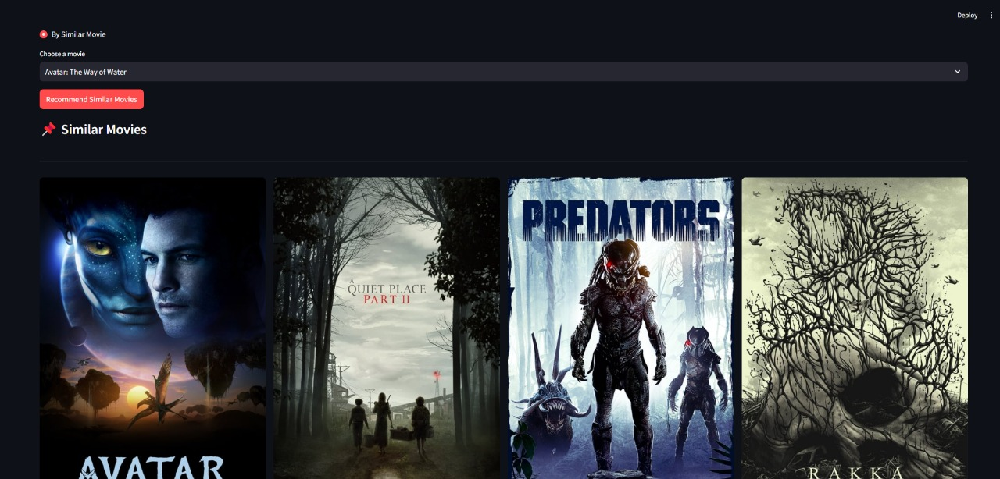

# 🎬 Movie Recommendation System

A personalized movie recommendation application built with Python and Streamlit that suggests movies based on user preferences or similar movies.

## 🌟 Features

- **Preference-based Recommendations**: Get movie suggestions based on:
  - Genre preferences
  - Current mood
  - Available watching time

- **Similar Movie Recommendations**: Find movies similar to your favorites
- **Interactive UI**: User-friendly interface with movie posters and details
- **Fast Processing**: Cached data processing for quick recommendations

## 🛠️ Technology Stack

- **Python 3.8+**
- **Streamlit**: Web interface
- **Pandas**: Data manipulation
- **scikit-learn**: TF-IDF vectorization and cosine similarity
- **NLTK**: Natural language processing

## 📋 Prerequisites

- Python 3.8 or higher
- pip (Python package manager)

## 🚀 Installation

1. Clone the repository:
```bash
git clone https://github.com/Manjesh501/Similar-movie-recommendation.git
cd Similar-movie-recommendation
```

2. Create and activate a virtual environment:
```bash
python -m venv venv
.\venv\Scripts\activate
```

3. Install required packages:
```bash
pip install -r requirements.txt
```

4. Download the movie dataset and place it in the `data` folder:
```bash
mkdir data
# Place movies.csv in the data folder
```

## 💻 Usage

1. Start the Streamlit app:
```bash
cd app
streamlit run main.py
```

2. Open your web browser and navigate to `http://localhost:8501`



3. Choose your recommendation type:
   - **By Preferences**: Select genres, mood, and available time
   - **By Similar Movie**: Select a movie you like

## 📁 Project Structure

```
movie_recommender/
├── app/
│   └── main.py
├── data/
│   └── movies.csv
├── src/
│   ├── config.py
│   ├── data_loader.py
│   ├── recommendation.py
│   └── utils.py
├── requirements.txt
└── README.md
```


## 📄 License

This project is licensed under the MIT License - see the LICENSE file for details.

## 🙏 Acknowledgments

- Movie dataset source:https://www.kaggle.com/datasets/asaniczka/tmdb-movies-dataset-2023-930k-movies

- Inspired by various recommendation systems
